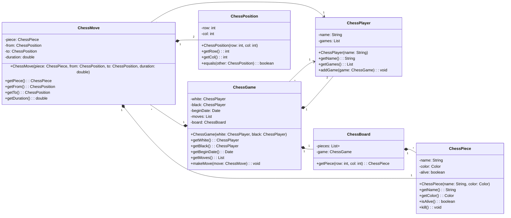

# Diagrama de Classes

Notas
- Catálogo de Jogos
- Catálogo de Jogadores
  - Ou só jogamos dois jogadores?

```mermaid
classDiagram
    direction LR

    ChessMove "*" --* "1" ChessGame
    ChessGame "1" *-- "2" ChessPlayer
    ChessGame "*" --> "1" ChessPlayer
    ChessMove "*" --> "1" ChessPlayer
    ChessMove "1" *-- "1" ChessPiece
    ChessMove "1" *-- "2" ChessPosition
    ChessGame "1" *-- "1" ChessBoard
    ChessBoard "1" *-- "*" ChessPiece

    class ChessGame {
        -white: ChessPlayer 
        -black: ChessPlayer 
        -beginDate: Date
        -moves: List<ChessMove>
        -board: ChessBoard

        +ChessGame(white: ChessPlayer, black: ChessPlayer)
        +getWhite(): ChessPlayer
        +getBlack(): ChessPlayer
        +getBeginDate(): Date
        +getMoves(): List<ChessMove>
        +makeMove(move: ChessMove): void
    }

    class ChessPlayer {
        -name: String
        -games: List<ChessGame>
        
        +ChessPlayer(name: String)
        +getName(): String
        +getGames(): List<ChessGame>
        +addGame(game: ChessGame): void
    }

    class ChessMove {
        -piece: ChessPiece
        -from: ChessPosition
        -to: ChessPosition
        -duration: double

        +ChessMove(piece: ChessPiece, from: ChessPosition, to: ChessPosition, duration: double)
        +getPiece(): ChessPiece
        +getFrom(): ChessPosition
        +getTo(): ChessPosition
        +getDuration(): double
    }

    class ChessPiece {
        -name: String
        -color: Color
        -alive: boolean

        +ChessPiece(name: String, color: Color)
        +getName(): String
        +getColor(): Color
        +isAlive(): boolean
        +kill(): void
    }

    class ChessPosition {
        -row: int
        -col: int

        +ChessPosition(row: int, col: int)
        +getRow(): int
        +getCol(): int
        +equals(other: ChessPosition): boolean
    }

    class ChessBoard {
        -pieces: List<List<ChessPiece>>
        -game: ChessGame

        +getPiece(row: int, col: int): ChessPiece
    }
```
